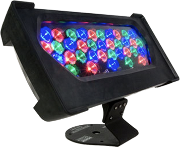

# A Brief Intro to DMX-512 and sACN

DMX-512 and Advanced controller Networking (ACN) or streaming ACN (sACN) are protocols that were developed for controlling lighting for live entertainment. Here's a brief intro to the protocols.

Here's a [slide deck summarizing this page](https://docs.google.com/presentation/d/1v5_xoVgS9_Ca4CZtl7slAypD7WOzldZXWcB1wp40x8w/edit?usp=sharing), if you like slides. It was written specifically for a presentation at [ITP](https://itp.nyu.edu), and refers to some of the equipment available there.

## What is DMX-512?

DMX-512 is a control protocol for stage lighting. It is an asynchronous serial communications protocol, based on the RS-485 protocol. It operates at 250 kilobits per second. You can send up to 512 channels of control information in a single DMX-512 message, with 1 byte of information per channel.

Originally, DMX was intended to control brightness of lights, but nowadays, it controls many other devices and other parameters of lights.

DMX-512 is a serial protocol, so you connect your controller to the device you want to control directly. When it was first introduced, this protocol was intended to control racks of AC dimmer circuits. Each rack would have a group of dimmers, and incandescent lights would be plugged into each dimmer. Each rack would have a control board with a DMX input and a DMX pass-through. Dimmer racks were daisy-chained, with the DMX control signal going into the input of the firstrack, then out of its pass through to the second rack, and so forth. This is generally referred to as a **DMX Universe**. Nowadays, LED fixtures have their own dimming circuits built into the fixture itself so they have DMX inputs and passthroughs right on the fixture. 

### What Kinds of DMX Fixtures Are There?

There are many different kinds of DMX fixtures. Most are stage lighting fixtures, like these:

**Ellipsoidal spotlights**, like the [ETC Source 4 LED](https://www.etcconnect.com/Products/Entertainment-Fixtures/Source-Four-LED-Series-3/Features.aspx) Spotlight (Figure 1) or the CoeMar [LEDKo Reflection LED Spotlight](http://www.coemar.com/products/ledko-hd-fullspectrum-6/) (Figure 2). Ellipsoidals, or Ellipsoidal Reflector Spotlights (ERS), also called LeKos, make a sharp-focused circle. These lights are long and tubular in form. They house the light source in front of a reflector towards the back of the fixture, and place a set of plano-convex lenses in front of the light source. This allows you to focus the light very precisely, by moving the light source relative to the reflector and the lenses relative to the light source. They have shutters to shape the beam, and sometimes an iris. They are typically used for front light, side light, or any time you need to focus the light fairly precisely.

_Figure 1. ETC Source 4 Ellipsoidal spotlight._

_Figure 2. CoeMar LEDKo Ellipsoidal spotlight._

**LED PAR lights** like the ETC Selador [Desire D40](https://www.etcconnect.com/Products/Entertainment-Fixtures/Desire-D40/Features.aspx) (Figure 3) and D60 LED PAR or the [ADJ DotZ PAR](https://www.adj.com/dotz-par) (Figure 4). These lights are generally compact, with an array of lensed LEDs on the front of the fixture. PARs give a broad, soft-edged light. They are generally inxpensive and used as workhorses in music shows.

_Figure 3. ETC Selador Desire D40 LED PAR._

_Figure 4. ADJ DotZ LED PAR._

**Gallery-style lights** like the [Rosco Miro Cube](https://us.rosco.com/en/product/miro-cube-4c) (Figure 5). These are small fixtures which give a broad, soft-edged light. They are good for gallery or architectural work. They tend to be less intense than PARs, and smaller. 

_Figure 5. Rosco Miro Cube light._

**Wash lights** like  the ColorKinetics [ColorBlast 4 and 8](https://www.colorkinetics.com/global/products/product-overview#.htmlpage=1&filters=Application%2FWall%20Washing%2C&page=1(Figure 6). These also give a broad, soft-edged light designed for washing walls with color The ColorKinetics units have a separate controller that's rather bulky.

_Figure 6. ColorKinetics wash light._

**Moving spotlights** like the [Elation Platinum Pro LED](https://www.elationlighting.com/platinum-spot-led-pro-ii/?SID=8u09kcu56f5is2hvsh7b0co8d2) (Figure 7). moving spotlight. These are spotlight with motorized control over 
pan, tilt, color wheel, zoom, focus, template via DMX.

_Figure 7. [ Elation Pro Platinum LED moving spotlight._

### A Brief History of Stage Lighting Technology, 1970's to Present

Stage lights have changed significantly since the 20th century. When DMX-512 was designed, most fixtures were incandescent fixtures, typically high-wattage sources, 750 watts or more. Each fixture generally only had one channel of lighting control. If you wanted to color the light, you put a color filter in front of the light. If you wanted to move the light, you positioned a technician with a communications headset next to the light. It was highly unusual to have more than 512 lights in a single light plot; typical stage shows might have between 12 and 300. All the DMX control lines could go to one central place, where the dimmers were, and power to the fixtures was broken out from the dimmers.

In the 80's and 90's, that started to change. Color scrollers and moving lights were introduced. A [color scroller](https://en.wikipedia.org/wiki/Color_scroller) is a motor with two spindles that scroll a series of different filters past the lens of the fixture.  [Moving head spotlights](https://www.stagelightingstore.com/842084-LED-Moving-Head-Spots_2) are mounted on a yoke with motors in the base and the side of the yoke, so the spotlight can be moved remotely. Moving mirror spotlights have a mirror that moves in two dimensions rather than moving the whole unit. See this page on [stage lighting for students](http://www.stagelightingprimer.com/index.html?slfs-fixtures.html&2) for pictures. These fixture add-ons are controllable via DMX-512 as well. 

The addition of these new accessories meant that instead of having one central point for the DMX-512 control lines to end, you had to run control to the lights themselves as well. It also meant that you needed a lot more channels of control. A fixture that formerly only needed one channel of control for intensity might now need intensity, pan, tilt, zoom, color, focus, gobo control, and more.  With the addition of LED fixtures, multiple channels of color control were introduced as well. 512 channels was no longer enough. That's why, in modern lighting systems where DMX is used, the channels are broken out into DMX universes, or groups of 512 channels.

Most DMX-controlled LED fixtures that don't need a separate dimming rack. These fixtures are usually daisy-chained, just like the racks used to be, so that the controller at the beginning of the chain can control all the fixtures. 

### What do DMX connectors look like?

There are three common connectors for DMX:
* XLR 5-pin (Figure 8)
* XLR 3-pin (Figure 9)
* Ethernet RJ-45 (Figure 10)

_Figure 8.XLR 5-pin connectors_

_Figure 9.XLR 5-pin connectors_

_Figure 10.XLR-to-RJ45 connectors_

There are many other kinds of DMX fixtures. It's also become popular to control LED strips and programmable LEDs with DMX, and for that purpose, there are a range of controllers you can buy. 

### What Do I Need If I want to Control DMX From My Computer?
First you'll need a USB-to-DMX adapter like the Enttec [DMX Pro](https://www.enttec.com/product/controls/dmx-usb-interfaces/dmx-usb-interface/) USB-to-DMX adapter or [DMXKing UltraDMX Micro](https://dmxking.com/usbdmx/ultradmxmicro) USB-to-DMX adapter.

You'll also need software that can communicate using your DMX interface. [QLC+](https://www.qlcplus.org/), the [TouchDesigner](https://derivative.ca/product) IDE, and [node.js](https://nodejs.org/en/) using the [node-dmx](https://github.com/node-dmx/dmx) library can all do this. 

### How are DMX Devices Connected Together?

Figure 11 shows a typical DMX universe. The controller connects to the first fixture, which is assigned the starting address 1. Its parameters, for example red intensity, green intensity, blue intensity, etc, are controlled with channels 1, 2, 3, and so forth. The second fixture is connected the the output of the first, and is given the starting address 21. Its parameters are controlled by channels 21, 22, 23, etc. The pattern continues to the third, fourth, and fifth fixtures in the Figure 1, which have starting addresses 41, 61, and 81, respectively. 

Starting addresses for each fixture are chosen based on how many parameters the fixture needs. Figure 11 was based on a set of fixtures that had 12 control parameters. Spacing each address 20 away from the previous made it easy to remember. In a crowded universe, however, you might set the address of one fixture right after the highest channel of the previous fixture. 

_Figure 11. A typical DMX universe of five fixtures. The fixtures are daisy-chained together, with each one's starting address set higher than the last channel of the previous fixture._

Figure 12 shows how you might control a DMX universe from your computer. A USB-to-DMX adapter like the ones mentioned above is connected to the computer, and the first lighting fixture is connected to the adapter. 

_Figure 12. A  DMX universe controlled by a personal computer using a USB-to-DMX adapter._

## What is sACN?

Streaming ACN (sACN) is a subset of the Advanced Controller Network protocol for stage lighting adopted by the Entertainment Services & Technology Association (ESTA) as a modern replacement for DMX512. There's a lot to it, but one thing it supports is DMX over IP networks. DMX messages are contained in UDP packets. sACN can handle multiple universes of DMX, each with 512 channels. It's also known as [E1.31](https://tsp.esta.org/tsp/documents/published_docs.php).

### What Do I Need If I Want to Control sACN Networks From My Computer?

You'll need an Ethernet-to-DMX adapter like the DMXKing [eDMX1 Pro](https://dmxking.com/artnetsacn/edmx1-pro) Ethernet-to-DMX adapter. You'll also need an Ethernet router, or a USB-to-Ethernet adapter. You'll want DMXKing's [DMXKing eDMX1 Pro Configuration Utility](https://dmxking.com/artnetsacn/edmx1-pro) as well.

Figure 13 shows a typical sACN network. Your controller is connected to an ethernet or WiFi network, and an sACN-to-DMX adapter like the eDMX1 Pro is attached to the same network via wired Ethernet. The controller sends sACN packets over the network to the adapter. Those packets contain DMX channel information. The adapter outputs DMX to the universe of fixtures attached to it, just like the DMX universes described in Figures 4 and 5. 

Best practice is to make the local area network for sACN a dedicated network that's carrying no other traffic and is not connected to the Internet. This ensures the best connectivity between controller and lights.

_Figure 13. An sACN network. The network is made up of an Ethernet and WiFi local area network (LAN), a controller which sends sACN data over UDP, and an sACN-to-DMX adapter which connects from the LAN to the DMX universe of fixtures._

Marina Victoria Pascual has a good [introduction to sACN for Touch Designer](https://www.marinavictoria.space/post/touchdesigner-gui-for-dmx-control-not-finished) as well. 