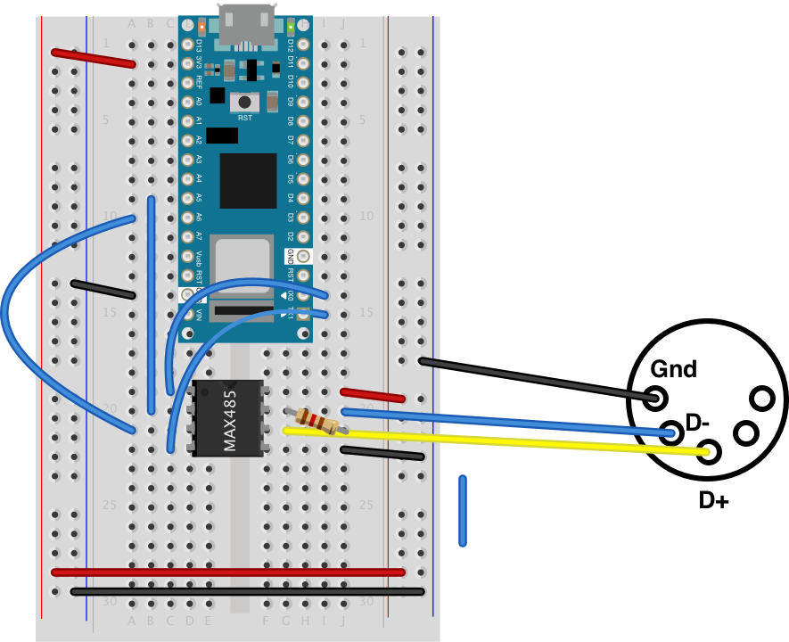

# ArduinoDMX

The [ArduinoDMX library](https://github.com/arduino-libraries/ArduinoDMX), originally written to work with the MKR series Arduinos and the MKR485 shield, will also enable you to send DMX-512 out from any Arduino to control DMX fixtures. This library uses the [ArduinoRS485 library](https://github.com/arduino-libraries/ArduinoRS485) and an RS485 transceiver chip like Maxim's [MAX485](https://www.maximintegrated.com/en/products/interface/transceivers/MAX485.html) chip to send DMX data.

## Hardware
* Arduino (any model)
* Arduino MKR485 shield (if you're using one of the MKR series Arduinos) or
* MAX485 chip
* DMX connector, either 5-pin or 3-pin

For reference, The Arduino circuits described here use these [breadboard layouts](https://itp.nyu.edu/physcomp/breadboard-layouts/)  and these [microcontroller pin arrangments](https://itp.nyu.edu/physcomp/lessons/microcontrollers/microcontroller-pin-functions/).

## Circuit

If you're using a MKR series Arduino and a MKR485 shield, you can simply plug the shield into the MKR board, connect an XLR connector to the shield, and you're ready to go. For other models, you'll need to connect your Arduino to a MSX485 chip, which will output the RS485 serial protocol on which DMX-512 depends. 

Connect your Arduino to a MAX485 chip as shown in Figure 1. The ArduinoRS485 library uses the following pins:

* *Serial TX* - on any board that has more than one hardware serial port, you should use the second one, i.e. `Serial1`. On the Uno and the Nano Every, there is only one hardware serial port, so you need to use that port, which is connected to pins 0 (Rx) and 1 (TX). The Arduino's Serial TX will connect to the MAX485's Driver Input (DI) pin. On the Uno, Serial TX is digital pin 1. On the Nano, it's physical pin 16. 
* *Serial RX* - just as with serial TX, use the `Serial1` port if there is one, otherwise use the only serial RX pin. Serial RX will connect to the MAX485's Receiver Out (RO) pin. On the Uno, Serial RX is digital pin 0. On the Nano, it's physical pin 17.
* *A5* - connect to the MAX485's Read Output Enable (RE) pin. On the Nano, that's physical pin 9.
* *A6* - connect to the MAX485's Driver Output Enable (DE) pin. On the Nano, that's physical pin 10.
* *Vcc and Ground* - Connect the Vcc and ground pins of the MAX485 chip to the ground and Vcc pins of your microcontroller.

_Figure 1. Arduino Nano 33 IoT connected to a MAX485 chip. The MAX485 is a DIP package. Its pins, reading in a U-pattern from top left, are RO, RE, DE, DI, GND, A, B, Vcc. The pins are connected as described above._

**Note:** on the Uno, you will not be able to use the Serial Monitor for debugging messages because the ArduinoRS485 library takes over the hardware serial port. *Check this on the Every too*

## Connect a DMX Connector

Connect a 120-ohm resistor between the MAX485's A and B output pins, and then connect the pins to the D+ and D- pins of a 3-pin or 5-pin female XLR connector, depending on the type of connector your DMX fixtures need. Connect them following the [DMX-512 standard layout](https://mediarealm.com.au/articles/dmx-3-pin-5-pin-wiring/). The pins in an XLR connector are arranged in a half circle. When facing the rear of a female XLR connector with the half circle of pins on the bottom, the pin numbers are arranged as follows, from left to right, counterclockwise:

* 3-pin: ground, D+, D-
* 5-pin: ground, D-, D+, D2-, D2+

The wiring from the MAX485 to the XLR connector is as follows:

* MAX485 pin 6 to the DMX connector's D- pin
* MAX485 pin 5 to the DMX connector's D+ pin
* Connector's ground pin to the ground of your circuit.

## MKR485 Shield Connections to DMX Connecto

If you're using a MKR485 shield, connect the DMX connector as follows:

* MKR485 shield ISO GND connected to DMX connector GND
* MKR485 shield Y pin connected to DMX connector D+ 
* MKR485 shield Z connected to DMX connector D-
* MKR485 shield jumper positions: Z \/\/ Y set to ON

## Examples
Once the circuit is ready, you can use any of the following examples or the [library's examples](https://github.com/arduino-libraries/ArduinoDMX/tree/master/examples) to get started.

* [DMX Fade multi channel](): fades each of the first four DMX channels from 0 to 255 and back to 0. When it finishes with each channel, it moves on to the next channel.
* [BLE to DMX](): creates a BLE peripheral with three characteristics, and sends the values of those three characteristics as DMX channel values when the characteristics change. 

