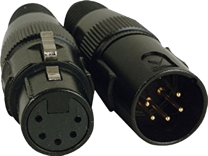
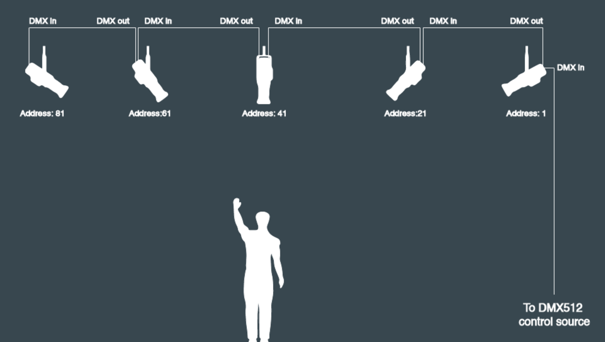
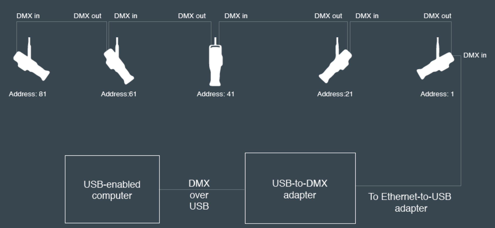

# A Brief Intro to DMX-512 and sACN

DMX-512 and Advanced controller Networking (ACN) or streaming ACN (sACN) are protocols that were developed for controlling lighting for live entertainment. Here's a brief intro to the protocols.

## What is DMX-512?

DMX-512 is a control protocol for stage lighting It is a serial communications protocol, based on RS-485. It operates at 250 kilobits per second. You can send up to 512 channels of  control information, with 1 byte of information per channel

Originally, DMX was intended to control brightness of lights, but nowadays, it controls many other devices and other parameters of lights.

DMX-512 is a serial protocol, so you connect your controller to the device you want to control directly. DMX fixtures are usually daisy-chained, with the output of one connecting to the input of the next, so that the controller at the beginning of the chain can control all the fixtures. This is generally referred to as a **DMX Universe**. 

## What do DMX connectors look like?

There are three common connectors for DMX:
* XLR 5-pin (Figure 1)
* XLR 3-pin (Figure 2)
* Ethernet RJ-45 (Figure 3)

_Figure 1.XLR 5-pin connectors_

_Figure 2.XLR 5-pin connectors_

_Figure 3.XLR-to-RJ45 connectors_

## What Do I Need If I want to Control DMX From My Computer?
First you'll need either a USB-to-DMX adapter like the Enttec [DMX Pro](https://www.enttec.com/product/controls/dmx-usb-interfaces/dmx-usb-interface/) USB-to-DMX adapter or [DMXKing UltraDMX Micro](https://dmxking.com/usbdmx/ultradmxmicro) USB-to-DMX adapter.

You'll also need software that can communicate using your DMX interface. [QLC+](https://www.qlcplus.org/), the [TouchDesigner](https://derivative.ca/product) IDE, and [node.js](https://nodejs.org/en/) using the [node-dmx](https://github.com/node-dmx/dmx) library can all do this. 

## How are DMX Devices Connected Together?

Figure 4 shows a typical DMX universe. The controller connects to the first fixture, which is assigned the starting address 1. Its parameters, for example red intensity, green intensity, blue intensity, etc, are controlled with channels 1, 2, 3, and so forth. The second fixture is connected the the output of the first, and is given the starting address 21. Its parameters are controlled by channels 21, 22, 23, etc. The pattern continues to the third, fourth, and fifth fixtures in the Figure 1, which have starting addresses 41, 61, and 81, respectively. 

Starting addresses for each fixture are chosen based on how many parameters the fixture needs. Figure 1 was based on a set of fixtures that had 12 control parameters. Spacing each address 20 away from the previous made it easy to remember. In a crowded universe, however, you might set the address of one fixture right after the highest channel of the previous fixture. 

_Figure 4. A typical DMX universe of five fixtures. The fixtures are daisy-chained together, with each one's starting address set higher than the last channel of the previous fixture._

Fugure 5 shows how you might control a DMX universe from your computer. A USB-to-DMX adapter like the ones mentioned above is connected to the computer, and the first lighting fixture is connected to the adapter. 

_Figure 5. A  DMX universe controlled by a personal computer using a USB-to-DMX adapter._

## What is ACN?

Advanced Control Networking (ACN), or streaming ACN (sACN) is a protocol for stage lighting adopted by USITT as a modern replacement for DMX512. Basically, it’s DMX over Ethernet. It works over IP networks. DMX messages are contained in UDP packets. ACN can handle multiple universes of DMX, each with 512 channels.

## What Do I Need If I Want to Control sACN Networks From My Computer?

You'll need an Ethernet-to-DMX adapter like the DMXKing [eDMX1 Pro](https://dmxking.com/artnetsacn/edmx1-pro) Ethernet-to-DMX adapter. You'll also need an Ethernet router, or a USB-to-Ethernet adapter. You'll want DMXKing's [DMXKing eDMX1 Pro Configuration Utility](https://dmxking.com/artnetsacn/edmx1-pro) as well.

Figure 6 shows a typical sACN network. Your controller is connected to an ethernet or WiFi network, and an sACN-to-DMX adapter like the eDMX1 Pro is attached to the same network via wired Ethernet. The controller sends sACN packets over the network to the adapter. Those packets contain DMX channel information. The adapter outputs DMX to the universe of fixtures attached to it, just like the DMX universes described in Figures 4 and 5. 

Best practice is to make the local area network for sACN a dedicated network that's carrying no other traffic and is not connected to the Internet. This ensures the best connectivity between controller and lights.

_Figure 6. An sACN network. The network is made up of an Ethernet and WiFi local area network (LAN), a controller which sends sACN data over UDP, and an sACN-to-DMX adapter which connects from the LAN to the DMX universe of fixtures._