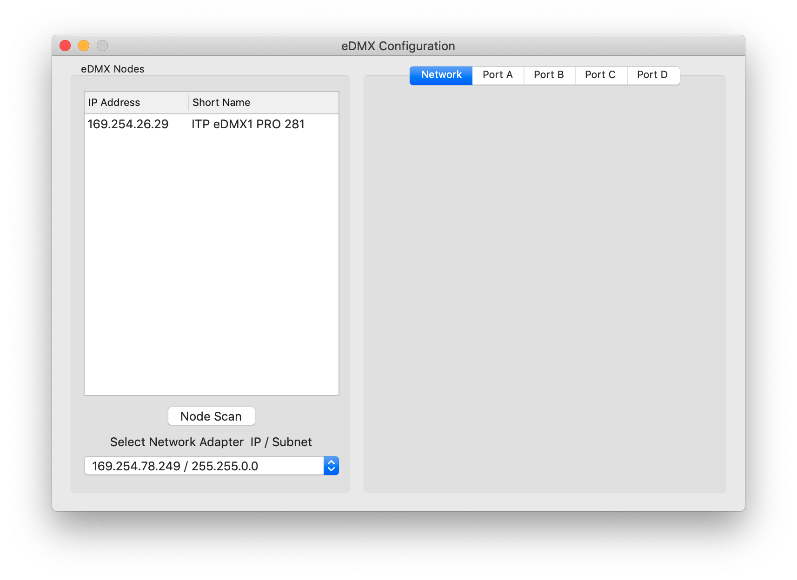

# Controlling DMX Fixtures with DMXKing's eDMX1 Pro 
DMXKing's eDMX1 Pro interface is an Ethernet-to-DMX adapter which can communicate via sACN or ArtNet. This tutorial shows how to configure it in TouchDesigner and in QLC+ to control regular DMX fixtures.

This has been tested on MacOS Mojave.

## Bill of Materials

* [eDMX1 Pro](https://dmxking.com/artnetsacn/edmx1-pro) 
* USB power supply for eDMX1 Pro
* Personal computer
* Ethernet connection to personal computer
* [TouchDesigner](https://derivative.ca/product) IDE, or 
* [QLC+](https://www.qlcplus.org/)
* [DMXKing eDMX1 Pro Configuration Utility](https://dmxking.com/artnetsacn/edmx1-pro)
* DMX-512 fixture such as an Elation [SIXPAR300](https://www.elationlighting.com/sixpar-300), a [Chroma-Q ColorCharge](https://chroma-q.com/products/color-charge), or an [ETC Desire D22](https://www.etcconnect.com/Products/Lighting-Fixtures/Desire-D22/Features.aspx?utm_campaign=Selador)

## Hardware Configuration
Power the eDMXPro via its USB connector. You can power it from a wall socket using a regular USB charging adapter, as long as the adapter can supply at least 150 milliamps. Connect the DMX connector of the unit to your DMX fixture, or to the first of your fixtures if you've got a chain of lights. Make sure you've set the starting addresses for all of your fixtures appropriately. If you're just using one fixture, starting address 1 will be fine.

## Network Configuration
 Connect the eDMX1 Pro to your computer via Ethernet. You can either connect both your computer and the eDMX1 Pro to the same router, or with many computers, you can connect them directly. For example, when you plug an eDMX1 Pro into a USB-to-Ethernet adapter on a Mac, the eDMX Pro1 assigns itself an IP address in the 169.254.x.x range, as shown in Figure 1. At that time, my computer also assigns itself an address in the same range. Open your system control panel and note the IP address of your Ethernet connection when the eDMX1 Pro is plugged in.

 If your eDMX1 Pro is not self-assigning open the eDMX Configuration software, as shown in Figure 2. The configuration software will probe all active network interfaces. It should add the USB-to-Ethernet connection to the list in that process. If the eDMX1Pro still won't self-assign, try turning off WiFi and then selecting the 169.254 interface and doing another node scan. In that case, your Ethernet connection would be the only network interface, and the configuration software would find it easier. You can turn WiFi back on once the eDMX1 Pro self-assigns.

 

_Figure 1. MacOS Network control panel showing a USB-to-Ethernet adapter, to which the eDMX1 Pro is attached. The eDMX1 Pro has self-assigned an IP address._ 

_Figure 2. eDMX Configuration software. The computer's WiFi has been turned off and a node scan performed to get the eDMX1 Pro to self-assign an address._ 

# TouchDesigner DMX CHOP Configuration
Now open TouchDesigner and add a DMX Out CHOP. In the DMX tab of the CHOP, set the interface to sACN. Then set the Universe to 1. In the Network tab, click the arrow of the Interface option menu and you should see the 169.254.x.x address that your computer self-assigned in the list. Pick that, or enter it manually. Now the DMX Out CHOP will communicate with the LeDMX Pro. 

DMX Tab (shown in Figure 3):
* Active - On  
* Interface - sACN
* Format - Packet Per Sample
* Universe - 1

Network Tab(shown in Figure 4):
* Multicast - On
* Network Address - 255.255.255.255
* Local Address - 169.254.x.x (the specific values of the last two bytes are determined by your computer's Ethernet address).

 

_Figure 3. DMX tab of a TouchDesigner DMX Out CHOP configured for sACN control._ 

_Figure 4. Network tab of a TouchDesigner DMX Out CHOP configured for sACN control. The USB-to-Ethernet's self-assigned IP address is shown in the Local Address field._ 

# QLC+ Configuration
If you're using QLC+, open the application and click the Inputs/Outputs tab. You'll see a list of input and output interfaces, as shown in Figure 5. One of them will have the self-assigned IP address beginning with 169.254.x.x. This is the eDMX1 Pro. Choose this as your output. 

Next, click the Simple Desk tab. You'll have a row of sliders. Slide any of them to control the corresponding DMX channel coming out of your eDMX1 Pro. 

_Figure 5. Inputs/Outputs tab of QLC+ showing the eDMX1 Pro on the 169.254.x.x. interface as the output. Unless you're taking input from another program, it doesn't matter what you choose as input._ 

# Example Program
This [touchDesigner program](https://github.com/tigoe/DMX-Examples/blob/master/TouchDesigner-Examples/eDMX-pro1-4-channel_Fixture.toe)  will control channels 1 through 4 of a DMX universe. 
