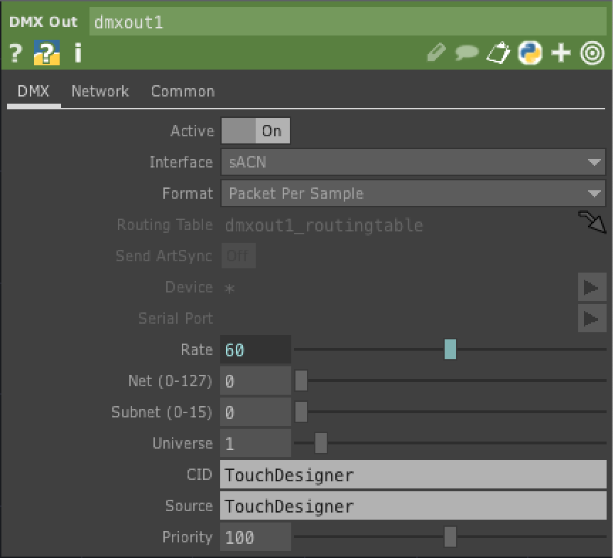
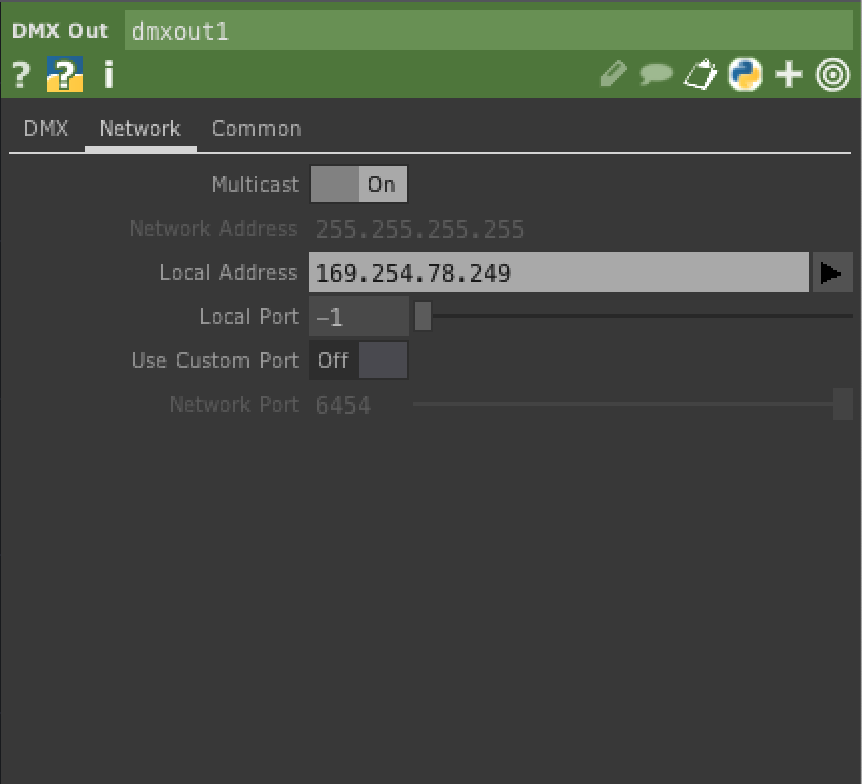

# Controlling Programmable LEDs with DMXKing's LeDMX Pro4 
DMXKing's LeDMX Pro4 interface is designed to control [addressable LEDs](https://tigoe.github.io/LightProjects/addressable-leds.html) such as the WorldSemi WS281x LEDs or APA's APA102C and related LEDs. 

This has been tested on MacOS Mojave.

## Bill of Materials

* [LeDMX4 Pro4](https://dmxking.com/led-pixel-control/ledmx4-pro) 
* 5V Power supply for LeDMX Pro4
* WS2812 LEDs
* Personal computer
* Ethernet connection to personal computer
* [TouchDesigner](https://derivative.ca/product) IDE

## Hardware Configuration
Make sure you've powered the LeDMX Pro4 correctly. WS2812 LEDs run on 5V, so a 5V power supply is the right supply for them. There are addressable LEDs that run on higher voltage, like the WS2815 (12V), and the LeDMX Pro4 is also available in a 12-24V model, but this tutorial uses the 5V version. 

Connect your LEDs to Universe 1 of the LeDMX Pro4 as shown in Figure 1.

_Figure 1. NeoPixel Jewel, a WS2812 module, connected to Universe 1 of a LeDMX Pro4. The 5V line is connected to +v, and ground is connected to GND. The control line is connected to DA._ 

## Network Configuration
 Connect the LeDMX Pro4 to your computer via Ethernet. You can either connect both your computer and the LeDMX Pro4 to the same router, or with many computers, you can connect them directly. For example, when you plug a LeDMX Pro4 into a USB-to-Ethernet adapter on a Mac, the LeDMX Pro4 assigns itself an IP address in the 169.254.x.x range, as shown in Figure 2. At that time, my computer also assigns itself an address in the same range. Open your system control panel and note the IP address of your Ethernet connection when the LeDMX Pro is plugged in.

 

_Figure 2. MacOS Network control panel showing a USB-to-Ethernet adapter, to which the LeDMX Pro4 is attached. The LeDMX Pro4 has self-assigned an IP address._ 

# TouchDesigner DMX CHOP Configuration
Now open TouchDesigner and add a DMX Out CHOP. In the DMX tab of the CHOP, set the interface to sACN. Then set the Universe to 1. In the Network tab, click the arrow of the Interface option menu and you should see the 169.254.x.x address that your computer self-assigned in the list. Pick that, or enter it manually. Now the DMX Out CHOP will communicate with the LeDMX Pro. 

DMX Tab (shown in Figure 3):
* Active - On  
* Interface - sACN
* Format - Packet Per Sample
* Universe - 1

Network Tab(shown in Figure 4):
* Multicast - On
* Network Address - 255.255.255.255
* Local Address - 169.254.x.x (the specific values of the last two bytes are determined by your computer's Ethernet address).

 

_Figure 3. DMX tab of a TouchDesigner DMX Out CHOP configured for sACN control._ 

_Figure 4. Network tab of a TouchDesigner DMX Out CHOP configured for sACN control. The USB-to-Ethernet's self-assigned IP address is shown in the Local Address field._ 

# Example Program
This [touchDesigner program](https://github.com/tigoe/DMX-Examples/TouchDesigner-Examples/LeDMX-pro-RGBW_Fixtures.toe)  will control three pixels of an RGBW WS2812 LED strip. 
