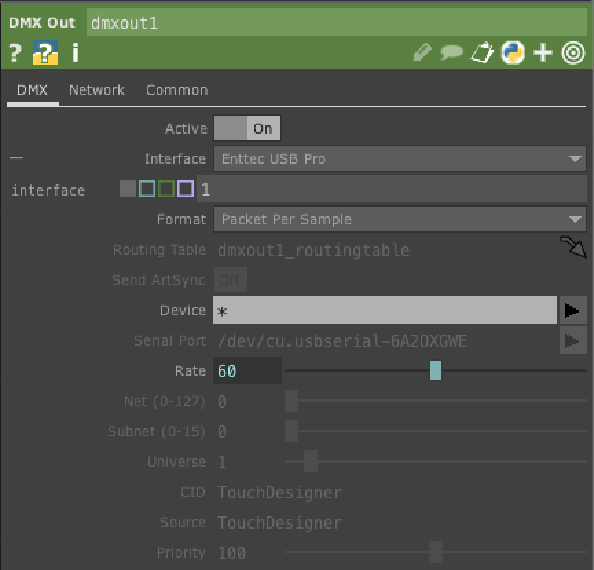
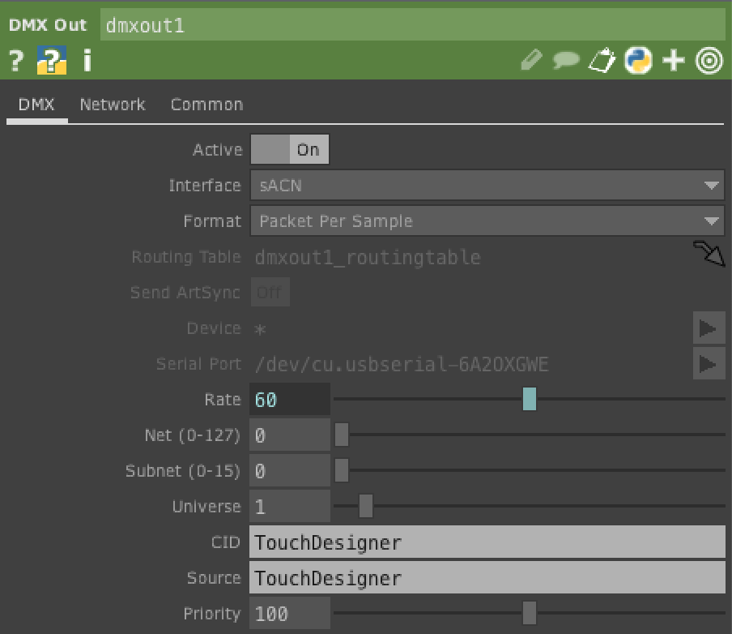

#  DMX and sACN Settings For TouchDesigner

The following are the settings for communicating va DMX-512 from Touch Designer:

## DMXKing UltraDMX Micro

You can use the DMXKing UltraDMX Pro with the DMX Out Chop if you set the serial port first. To do this, set the DMX Out Interface setting to `Enttec Generic Serial`. Then click on the Serial Port option menu to choose your port. Then click the Interface menu to change back to `Enttec USB Pro MK2`. 

__DMX Out CHOP settings (Shown in Figure 1):__
* Interface: Enttec USB Pro MK2
* Format: Packet per Sample
* Serial Port: Choose the port of the ULtraDMX Micro

 

_Figure 1. DMX tab of a TouchDesigner DMX Out CHOP configured for control via DMXKing UltraDMX Micro or for Enttec USB Pro Mk2. Note the Serial Port setting for the DMXKing unit._ 

## Enttec USB Pro Mk2

The Enttec USB Pro Mk2 is the default DMX module for the TouchDesigner DMX Out chop. You should be able to jhust plug it in and go, as long as your computer recognizes the USB Pro Mk2 unit. There may be issues with this on Mac OS Big Sur and later, however. See Enttec's site for the [Pro Mk 2 user manual](https://www.enttec.com/product/controls/dmx-usb-interfaces/dmx-usb-pro-interface/), and notes on how to install the drivers. 

__DMX Out CHOP settings (Shown in Figure 1):__
* Interface: Enttec USB Pro MK2
* Format: Packet per Sample

## sACN (Network) Configuration
You can also send sACN packets to an Ethernet-to-DMX device like the DMXKing eDMX 1 Pro. These instructions assume that your computer and your Ethernet-to-DMX adapter are on the same local network, not connected directly to each other.

First, in the DMX tab of the DMX Out CHOP, turn `Active` to off and set the interface to sACN. Then set the Universe to 1. Now in the Network tab, turn multicast off, then enter your computer's network interface address in the `Local Address` field, and the address of your Ethernet-to-DMX interface in the `Network Address` field. Then go back to the DMX tab and turn `Active` to on. Now the DMX Out CHOP will communicate with the eDMX Pro. 

__DMX Tab (shown in Figure 2):__
* Active - On  
* Interface - sACN
* Format - Packet Per Sample
* Universe - 1

__Network Tab(shown in Figure 3):__
* Multicast - On
* Network Address - your Ethernet-to-DMX converter's address
* Local Address - the address of your computer's network interface.
* Your computer and the Ethernet-to-DMX device need to be on the same local network. 

 

_Figure 2. DMX tab of a TouchDesigner DMX Out CHOP configured for sACN control._ 

_Figure 3. Network tab of a TouchDesigner DMX Out CHOP configured for sACN control._