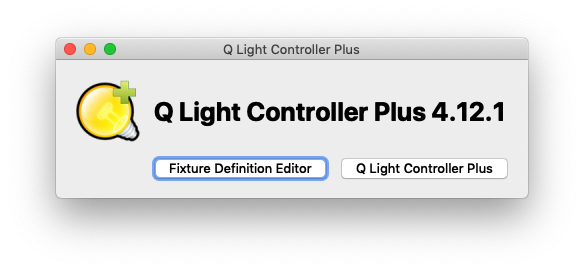
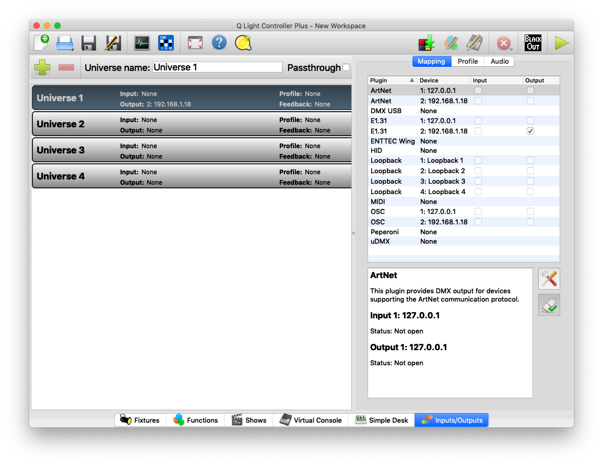
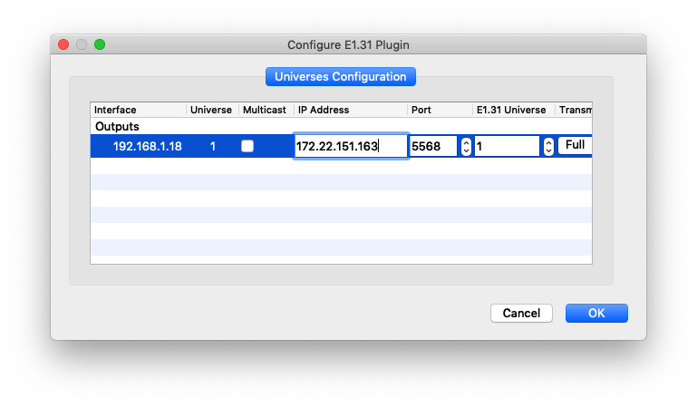
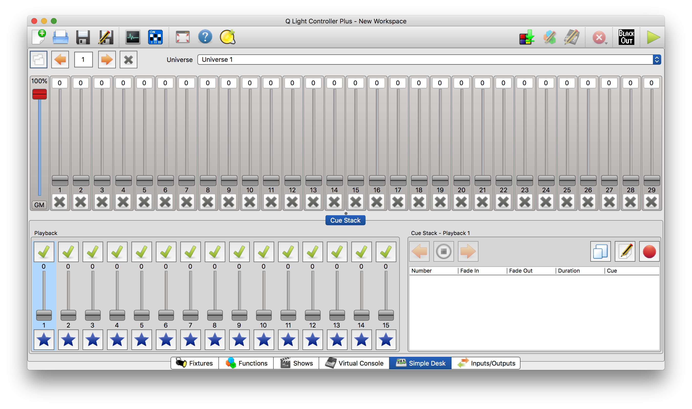

# Introduction to QLC+

QLC+ is a feee software package for controlling DMX-512 systems. You can connect it to your system via a number of different interfaces: USB-to-DMX adapters, DMX-to-Ethernet adapters, WiFi, Ethernet, and more. It's useful as a diagnostic tool when you need to send DMX from your laptop without doing any programming. Though there are other more advance DMX controller apps on the market, QLC+ offers a simple interface to test with. 

The notes here work with release 4.12.6. 

After installing QLC+ and launching the application, you will see the  window shown in Figure 1.  Select `Q Light Controller Plus`.

_Figure 1. QLC+ intro screen_

## Inputs / Outputs

QLC+ is able to act as a router, acceptings a variety of different control inputs (such as Arduino-based lighting controllers) and outputting on a number of different lighting control protocols (DMX, ArtNet, Streaming-ACN, etc.)  To set up an Input or Output, first select the "Inputs / Outputs" tab on the bottom bar of the window.  Figure 2 shows the QLC+ inputs and outputs panel. These are all the interfaces that the program can use to talk to our DMX devices. 

_Figure 2. QLC+ Inputs/outputs panel._

#### Setting up a E1.31 (Streaming-ACN) Output

To create a Streaming-ACN (also known sACN or as E1.31) output from the "Inputs / Outputs" panel, first click the `Output` radio button next to `E1.31`.  Note that there are two `E1.31` Plugins.  One of them should list `127.0.0.1` (your computer's localhost address) as the device.  The other should list your computer's IP on the local network (usually `192.168.X.XXX` on a home network or `10.XX.XX.XX`  or `172.XX.XX.XX` on an enterprise network such as NYU).  Click the "Output" radio button on the second `E1.31` option (the one on your local network).  

Then, double click on this connection and you will be presented with a configuration screen which looks like this: 

Figure 3 shows the configuration panel for one of the I/O interfaces, spefifically your WiFi interface. 

_Figure 3. Configuring your WiFi interface for E1.31._

By default, sACN (`E1.31`) systems assume you're operating over a dedicated subnet with no other devices other than your controller and the DMX devices you want to control. As a result, the default network setting is to send packets to the multicast address on the subnet, which is `XX.XX.XX.255`. If you're sending sACN messages on a shared network, or worse, the internet at large, you _definitely_ don't want to multicast. Instead, send to a specific address. To connect to a specific output device accepting `E1.31` as an input, uncheck the `Multicast` radio button and enter the IP address and port of your device.

## Controlling Lights

Finally, switch over to the "Simple Desk" tab at the bottom of the screen to use QLC+'s lighting board. This will now allow you to send lighting control to the E1.31 (Streaming-ACN) output we specified in the "Inputs / Outputs" tab.

Figure 4 shows the simple light control desk. 

_Figure 4. QLC+ Simple Light Control Desk_